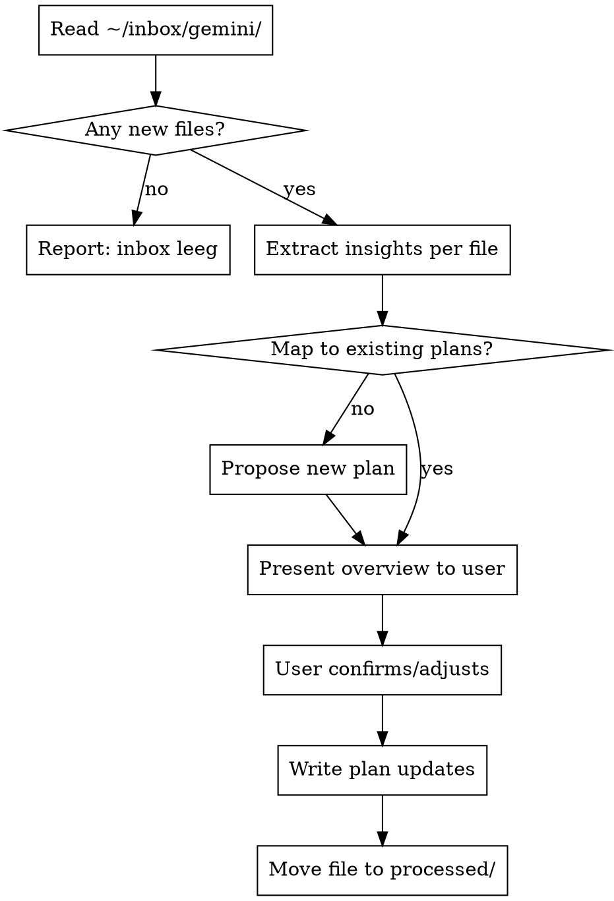

# Verwerk Inbox

## Overview

Structured intake workflow for new Gemini chat exports. Reads new files from `~/inbox/gemini/`, extracts policy-relevant insights, maps them to existing plans or proposes new ones, waits for user confirmation, then writes the updates.

## Trigger

User says: "verwerk inbox", "verwerk de inbox", "process inbox"

## Workflow



## Step 1: Scan inbox

Read all `.md` files in `~/inbox/gemini/` that are NOT in `~/inbox/gemini/processed/`.

If none: report "Inbox is leeg." and stop.

## Step 2: Extract insights per file

For each file, identify:
- **Nieuwe concepten of termen** — definitieverdieping, nieuw frame, nieuwe metafoor
- **Weerleggingen** — hoe bezwaren worden ontkracht (bruikbaar voor plannen)
- **Rekenvoorbeelden** — concrete getallen of scenario's
- **Politieke positionering** — hoe het model wordt geframed naar doelgroepen
- **Niets bruikbaars** — conversatie die geen planrelevantie heeft

## Step 3: Bepaal project en map to existing plans

### Project routing

| Type inhoud | Project | Locatie |
|---|---|---|
| Blog artikel, essay, publieke tekst | `rolfst-essays` | nieuwe map per artikel of update bestaand artikel |
| Beleidsplan, addendum, positiepaper | `Policies` | `.sisyphus/plans/` |
| Neogeorgisme, fiscaal kader, LVT | `Policies` | `.sisyphus/plans/` |
| Communicatiestrategie, forum-reacties | `Policies` | `.sisyphus/plans/` |
| Begrotingsberekeningen, rekenvoorbeelden | `Policies` | `.sisyphus/plans/` |

**Signaaltermen voor `rolfst-essays`:**
- "blog", "essay", "substack", "linkedin", "publiek artikel"
- Conversatie gaat over schrijfstijl, publieksgericht communiceren
- Concrete uitgewerkte tekst die direct publiceerbaar is

**Signaaltermen voor `Policies`:**
- "beleid", "addendum", "plan", "weerlegging", "politieke positionering"
- Technische economische analyse
- Argumentatie voor de policy-groep of economen

**Bij twijfel:** vraag de gebruiker voor de bevestigingsstap welk project het betreft.

### Plan mapping

Lees alle bestanden in:
- `/home/rolfst/workspaces/Astra-Europa/Policies/.sisyphus/plans/`
- `/home/rolfst/workspaces/rolfst-essays/` (top-level mappen per essay)

Voor elke essay-map in `rolfst-essays/`: lees `status.md` als die bestaat. Relevante velden:
- `published: true` -- artikel is live; voeg geen inhoud toe, stel hooguit een follow-up artikel voor
- `published: false` of geen `status.md` -- toevoeging is mogelijk

Voor elk extracted insight:

| Insight type | Mapping logic |
|---|---|
| Verdieping bestaand concept | Voeg toe aan bestaand plan |
| Nieuwe weerlegging | Voeg toe aan meest relevante plan |
| Nieuw concept zonder passend plan | Stel nieuw plan voor in juist project |
| Politieke framing | `Policies`: neogeorgisme of blog plan |
| Rekenvoorbeeld | `Policies`: begrotingsfeasibility of blog plan |
| Uitgewerkte blogtekst, nog niet gepubliceerd | `rolfst-essays`: toevoegen aan bestaand artikel |
| Uitgewerkte blogtekst, al gepubliceerd | `rolfst-essays`: nieuw artikel voorstellen als follow-up |
| Uitgewerkte blogtekst, geen passend artikel | `rolfst-essays`: nieuw artikel, nieuwe map |

## Step 4: Present overview — STOP EN WACHT

Presenteer het volgende overzicht aan de gebruiker en **stop**. Schrijf nog niets.

Voor elk inzicht dat naar `rolfst-essays` gaat: lees `status.md` in de betreffende map.

| Situatie | Actie |
|---|---|
| Geen passend artikel gevonden | Nieuw artikel voorstellen, nieuwe map |
| Passend artikel, geen `status.md` of `published: false` | Toevoeging aan bestaand artikel voorstellen |
| Passend artikel, `published: true` | Nieuw follow-up artikel voorstellen |

De vraag "nieuw artikel of toevoegen aan bestaand?" wordt nooit gesteld -- de status geeft het antwoord.

```
## Inbox verwerking — overzicht

### [bestandsnaam]
**Nieuwe inzichten:**
- [inzicht 1] → [Policies] toevoegen aan [plan X]
- [inzicht 2] → [rolfst-essays] nieuw artikel → nieuwe map `[voorgestelde-mapnaam]`
- [inzicht 3] → [rolfst-essays] toevoegen aan `[mapnaam]` (niet gepubliceerd)
- [inzicht 4] → [rolfst-essays] nieuw follow-up artikel op `[mapnaam]` (gepubliceerd)
- [inzicht 5] → [Policies] nieuw plan voorgesteld: [titel]

**Niet bruikbaar:**
- [onderwerp] — buiten scope

---
Wil je dat ik bovenstaande verwerk? Je kunt ook aangeven welke punten je wil overslaan of aanpassen.
```

## Step 5: Na bevestiging — schrijf updates

Pas alleen aan wat de gebruiker heeft goedgekeurd. Volg het schrijfpatroon van het betreffende plan exact.

**Regels:**
- Geen em-dashes (—) in documenten
- Schrijf in de taal van het plan (EN of NL)
- Voeg toe aan de juiste sectie van het plan, niet aan het einde
- Markeer toegevoegde inhoud niet apart — het wordt gewoon onderdeel van het plan

## Step 6: Verplaats verwerkte bestanden

Na schrijven:

```bash
mv ~/inbox/gemini/[bestandsnaam].md ~/inbox/gemini/processed/$(date +%Y-%m-%d)-[bestandsnaam].md
```

## Wat deze skill NIET doet

- Voert geen nixos-rebuild uit
- Past geen beleidsdocumenten aan (alleen plannen)
- Verwijdert geen bestanden uit Google Drive
- Maakt geen commits
